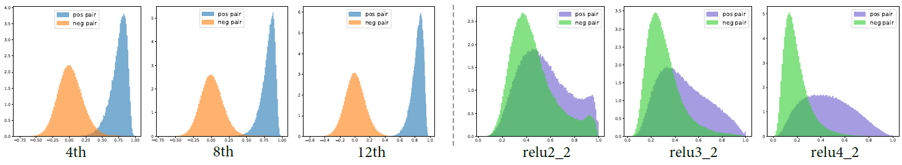
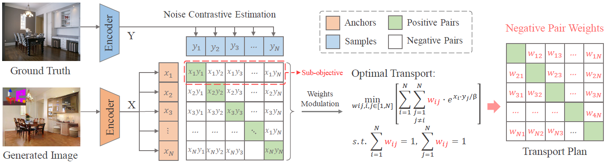

# Modulated Contrast for Versatile Image Synthesis


## [Paper](https://www.researchgate.net/publication/359291272_Modulated_Contrast_for_Versatile_Image_Synthesis)  |  [Project page](https://sites.google.com)  | [Video](https://www.youtube.com/)
<!-- Modulated Contrast for Versatile Image Synthesis (Arxiuv). -->
<!-- <br> -->
[Fangneng Zhan](https://fnzhan.com), [Jiahui Zhang](https://scholar.google.com.sg/citations?user=DXpYbWkAAAAJ&hl=en), [Yingchen Yu](https://scholar.google.com.sg/citations?user=0cet0X8AAAAJ&hl=en), [Rongliang Wu](https://scholar.google.com.sg/citations?user=SZkh3iAAAAAJ&hl=en), [Shijian Lu](https://scholar.google.com.sg/citations?user=uYmK-A0AAAAJ&hl=en) <br>
Nanyang Technological University, Singapore <br>

## MoNCE outperforms Perceptual Loss and PatchNCE Loss.

Abstract: 
*This paper presents MoNCE, a versatile metric that introduces image contrast to learn a calibrated metric for the perception of multifaceted inter-image distances. Unlike vanilla contrast which indiscriminately pushes negative samples from the anchor regardless of their similarity, we propose to re-weight the pushing force of negative samples adaptively according to their similarity to the anchor, which facilitates the contrastive learning from informative negative samples. Since multiple patch-level contrastive objectives are involved in image distance measurement, we introduce optimal transport in MoNCE to modulate the pushing force of negative samples collaboratively across multiple contrastive objectives.*
<!-- Extensive experiments show that the proposed MoNCE outperforms prevailing Perceptual Loss and PatchNCE Loss.* -->



<!-- ## Introduction -->
<!-- We provide our PyTorch implementation of unpaired image-to-image translation based on patchwise contrastive learning and adversarial learning.  -->


## Prerequisites
- Linux or macOS
- Python3, PyTorch
- CPU or NVIDIA GPU + CUDA CuDNN

## Installation
Please follow the guidance in [SPADE](https://github.com/NVlabs/SPADE) and [CUT](https://github.com/taesungp/contrastive-unpaired-translation).


## Inference Using Pretrained Model
#### Unpaired Image Translation (CUT):
The pretrained model on Cityscapes, Horse2Zebra, Winter2Summer can be downloaded from [Google Drive](https://drive.google.com/drive/folders/1A0lYIu-vH_s8GeIry0angigEYwj6JNGm?usp=sharing). Put them into CUT_MoNCE/checkpoints and run the command 
````
cd CUT_MoNCE
bash test_cityscapes.sh
````


#### Paired Image Translation (SPADE):
The pretrained model on ADE20K, CelebA-HQ, DeepFashion can be downloaded from [Google Drive](https://drive.google.com/drive/folders/1MxTTrx7PgIfdmzZxvlk8U_ExFTye6MV7?usp=sharing). Put them into SPADE_MoNCE/checkpoints and run the command 
````
cd SPADE_MoNCE
bash test_ade20k.sh
````


## Training
#### Unpaired Image Translation (CUT):
Run the command 
````
cd CUT_MoNCE
bash train_cityscapes.sh
````

#### Paired Image Translation (SPADE):
Run the command 
````
cd SPADE_MoNCE
bash train_ade20k.sh
````


## Citation
If you use this code for your research, please cite our papers.
```bibtex
@inproceedings{zhan2022modulated,
  title={Modulated contrast for versatile image synthesis},
  author={Zhan, Fangneng and Zhang, Jiahui and Yu, Yingchen and Wu, Rongliang and Lu, Shijian},
  booktitle={Proceedings of the IEEE/CVF Conference on Computer Vision and Pattern Recognition},
  pages={18280--18290},
  year={2022}
}
```

## Acknowledgments
This code borrows heavily from [CUT](https://github.com/taesungp/contrastive-unpaired-translation) and [SPADE](https://github.com/NVlabs/SPADE).
